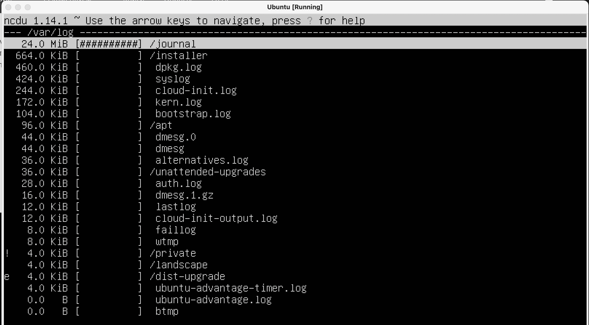

# Операционные системы UNIX/Linux (Базовый).

Установка и обновления системы Linux. Основы администрирования.

## Part 1. Установка ОС

Ubuntu 20.04 Server LTS** без графического интерфейса
- 

## Part 2. Создание пользователя

Вызов команды для создания пользователя
- 
- 

## Part 3. Настройка сети ОС

Меням hostname, timezone. 
- 
- 
- 
- lo - внутреняя сеть, en... - внешняя
- 
- Dynamic Host Configuration Protocol — протокол динамической настройки узла  

внешний ip-адрес шлюза
- 

внутренний IP-адрес шлюза
- 

Задаем статические настройки ip, gw, dns
- 
- 
- 
- 

0 loss - значит все правильно!
- 
- 

## Part 4. Обновление ОС

- 

## Part 5. Использование команды **sudo**

- Главное назначение sudo — это выполнить команду от имени другого пользователя, обычно от root.
- 
- 

## Part 6. Установка и настройка службы времени

- 
- 

## Part 7. Установка и использование текстовых редакторов

- 
- esc :wq
- 
- ^С y ^M
- 
- ^KX

##### 2

- 
- esc :q!
- 
- ^С n
- 
- ^C y

##### 3

- 
- /что ищем
- 
- :s/что меняем/замена

- 
- ^W что ищем
- 
- ^R замена y
- 
- ^KF что ищем entr
- 
- ^KF что заменяем entr R замена

## Part 8. Установка и базовая настройка сервиса **SSHD**

-  sudo apt install openssh-server (устанавливаем службу)
-  
-  
-  

## Part 9. Установка и использование утилит **top**, **htop**

- 
    - uptime 5:39
    - количество авторизованных пользователей 1 user
    - общую загрузку системы 0.00
    - общее количество процессов 108
    - cpu 0.0 
    - загрузку памяти 976.9
    - pid процесса занимающего больше всего памяти 1 root
    - pid процесса, занимающего больше всего процессорного времени 1 root

fdisk
- 
- 
- 
- 
- 
- 

## Part 10. Использование утилиты **fdisk**

- 

## Part 11. Использование утилиты **df**

- 
- 

## Part 12. Использование утилиты **du**

- 

- 
- 
- 

## Part 13. Установка и использование утилиты **ncdu**

- 
- 
- 

## Part 14. Работа с системными журналами

- 
- 

## Part 15. Использование планировщика заданий **CRON**

- 
- 
- 
